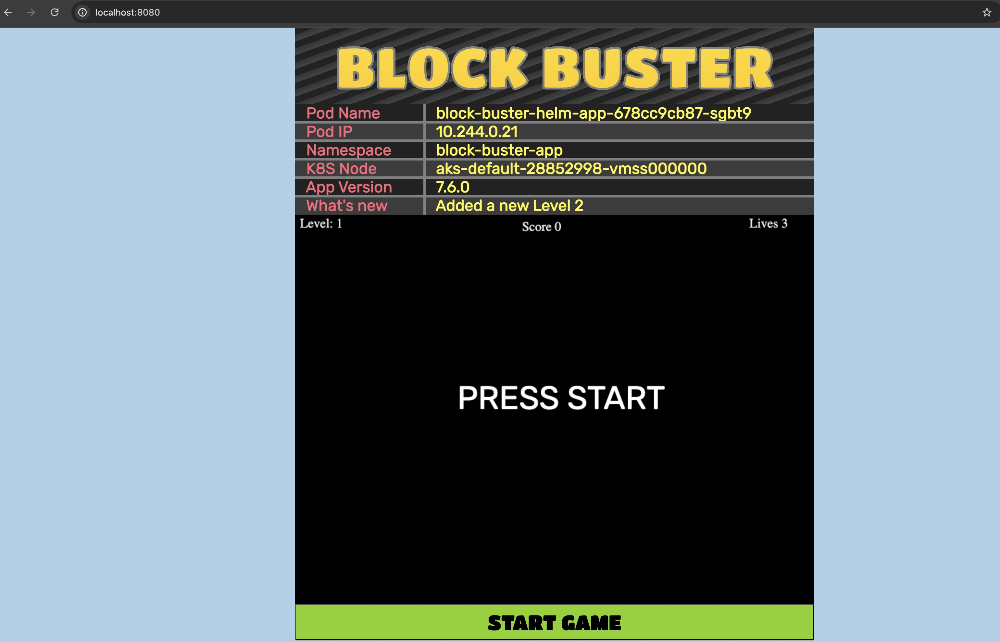

## PreRequisites

> [!IMPORTANT]  
> Before you begin setting up this project, make sure the following tools are installed and configured properly on your system:

## Setup & Initialization <br/>

### 1. Install [Kubectl](https://kubernetes.io/docs/tasks/tools/#kubectl)
#### Linux
```bash
curl -LO "https://dl.k8s.io/release/$(curl -L -s https://dl.k8s.io/release/stable.txt)/bin/linux/amd64/kubectl"
sudo install -o root -g root -m 0755 kubectl /usr/local/bin/kubectl
kubectl version --client
```
### 2. Install [Helm](https://helm.sh/docs/intro/install/)
#### Linux
```bash
curl -fsSL -o get_helm.sh https://raw.githubusercontent.com/helm/helm/main/scripts/get-helm-3
chmod 700 get_helm.sh
./get_helm.sh
```
### 3. Install Terraform
* Install Terraform<br/>
#### Linux & macOS
```bash
curl -fsSL https://apt.releases.hashicorp.com/gpg | sudo apt-key add -
sudo apt-add-repository "deb [arch=amd64] https://apt.releases.hashicorp.com $(lsb_release -cs) main"
sudo apt-get update && sudo apt-get install terraform
```
### Verify Installation
```bash
terraform -v
```
### Initialize Terraform
```bash
terraform init
```
### 4. Setup Azure CLI
Start by logging into Azure by run the following command and follow the prompts:

```az login --use-device-code```

###  Authentication with Azure CLI
Terraform needs to authenticate with Azure to create and manage resources. Since you are already logged in to the Azure CLI, you can run the following command to set up Terraform authentication:

```export ARM_SUBSCRIPTION_ID=$(az account show --query id -o tsv)```

> [!NOTE] 
> This environment variable will be used by Terraform to determine which Azure subscription to use when creating resources.

## Getting Started

> Follow the steps below to get your infrastructure up and running using Terraform:<br/>

1. **Clone the Repository:**
First, clone this repo to your local machine:<br/>
```bash
git clone https://github.com/emmanuelogar/block-buster-app-aks
cd terraform/aks
```
## (OPTIONAL)
2. **State management with Azure Storage:**
Terraform uses state files to keep track of the resources it manages. These state files are stored locally by default, but it's a best practice to store them remotely, especially when working in teams or in production environments.

To store the Terraform state in Azure Storage, you need to create a storage account and a container to hold the state files. You can do this using the Azure CLI or the Azure portal. For this workshop, we will use the Azure CLI.

First, create a resource group to hold the storage account:
```
az group create \
--name rg-tfstate \
--location eastus
```
Set the name of your storage account. The name must be globally unique across Azure, so you may need to change it to something unique for your subscription:
```
export STORAGE_ACCOUNT_NAME=terraformstate$(date +%s)
```
Next, create a storage account within that resource group:
```
az storage account create \
--name ${STORAGE_ACCOUNT_NAME} \
--resource-group tf-backend-rg \
--sku Standard_LRS
```
Now, create a container within the storage account to hold the Terraform state files:
```
az storage container create \
--name terraform-state \
--account-name ${STORAGE_ACCOUNT_NAME}
```
Now that you have created the storage account and container, you can configure Terraform to use this remote storage for state management. Update your terraform block and add in your provider.tf file and add the following code under required_providers:
```
backend "azurerm" {
  resource_group_name  = "rg-tfstate"
  storage_account_name = "SET_YOUR_STORAGE_ACCOUNT_NAME_HERE"
  container_name       = "tfstate"
  key                  = "infra.tfstate"
}
```

3. **Initialize Terraform:**
Initialize the Terraform working directory to download required providers:
```bash
terraform init
```
4. **Review the Execution Plan:**
Before applying changes, always check the execution plan:
```bash
terraform plan
```
5. **Apply the Configuration:**
Now, apply the changes and create the infrastructure:
```bash
terraform apply
```
> Confirm with `yes` when prompted.

6. **Update your kubeconfig:**
Now, let's connect to the AKS cluster using the Azure CLI. You can do this by running the following command to pass Terraform outputs to the Azure CLI command:
```bash
az aks get-credentials \
--resource-group $(terraform output -raw rg_name) \
--name $(terraform output -raw aks_name)
```
7. **Check your cluster:**
```bash
kubectl get nodes
```
8. **Deploy helm to aks cluster :**
```bash
./deploy.sh
```
9. **Quick Test (port-forwarding) If you just want to check quickly from your local machine: :**
```bash
kubectl get svc -n block-buster-app                             
NAME                    TYPE        CLUSTER-IP   EXTERNAL-IP   PORT(S)   AGE
block-buster-helm-app   ClusterIP   10.0.55.89   <none>        80/TCP    61s

kubectl port-forward svc/block-buster-helm-app 8080:80 -n block-buster-app
```
👉 Then open in browser:
http://localhost:8080

### 📌 Block Buster App
